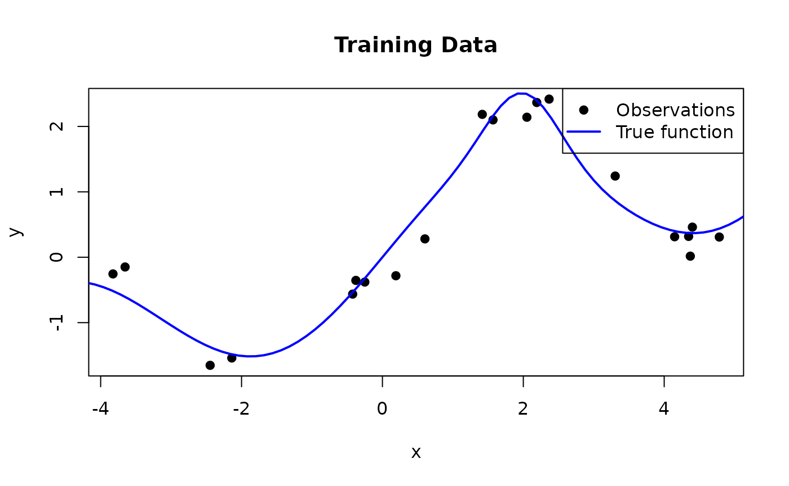
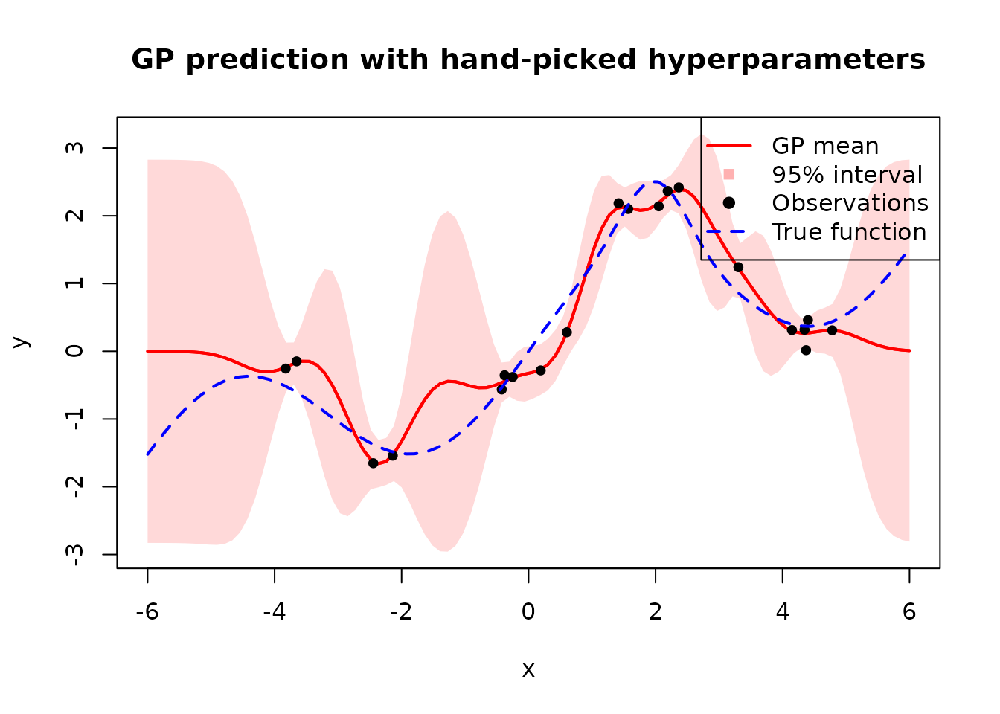
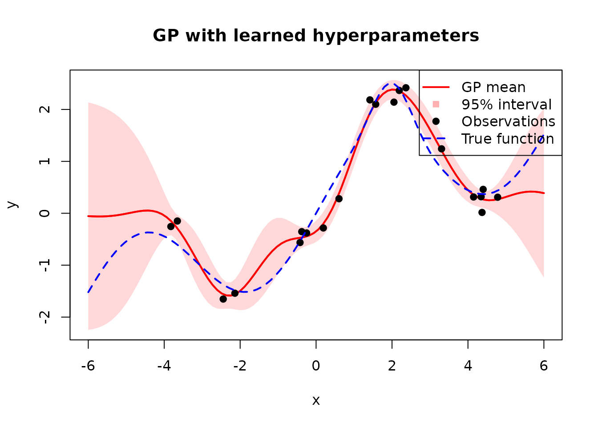
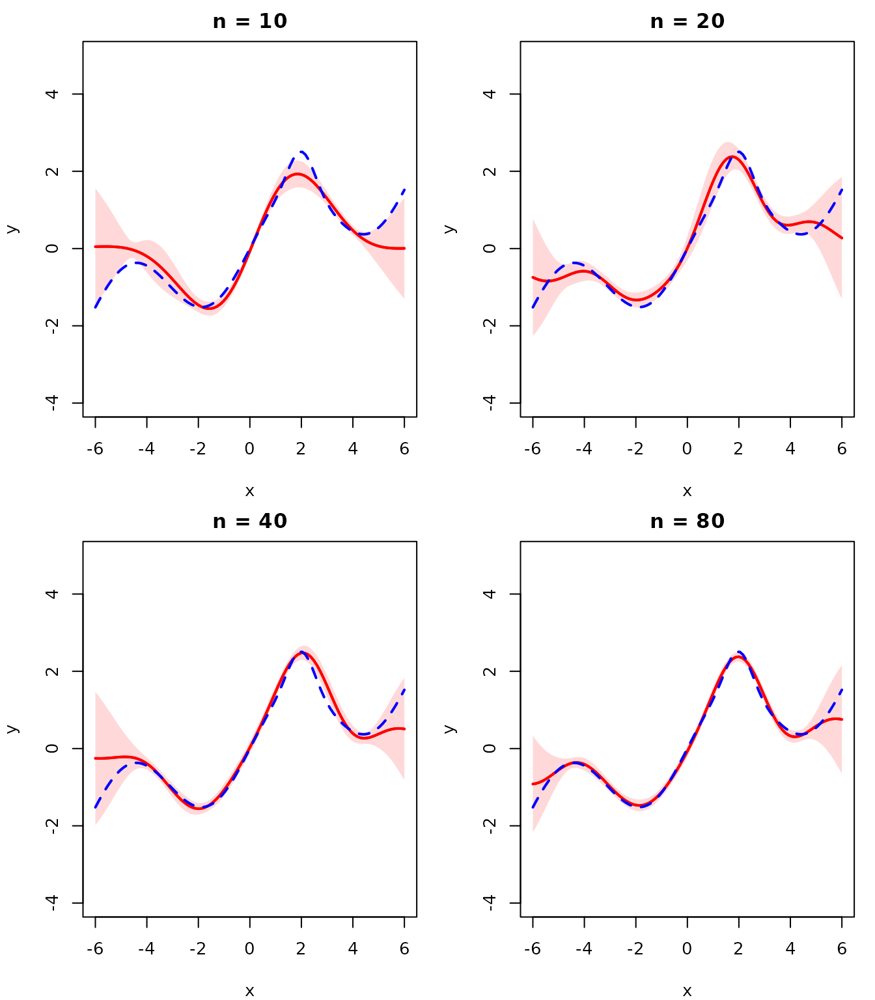

# Gaussian Process

In this vignette, we implement a Gaussian Process (GP) regression model
from scratch.

A Gaussian Process is a collection of random variables, any finite
subset of which follows a joint Gaussian distribution. A GP is fully
specified by a mean function \\m(\mathbf{x})\\ and a covariance (kernel)
function \\k(\mathbf{x}, \mathbf{x}')\\:

\\f(\mathbf{x}) \sim \mathcal{GP}\bigl(m(\mathbf{x}),\\ k(\mathbf{x},
\mathbf{x}')\bigr)\\

For any finite set of inputs \\\\\mathbf{x}^{(1)}, \dots,
\mathbf{x}^{(n)}\\\\, the corresponding function values \\\mathbf{f} =
\[f(\mathbf{x}^{(1)}), \dots, f(\mathbf{x}^{(n)})\]^\top\\ are jointly
Gaussian:

\\\mathbf{f} \sim \mathcal{N}\bigl(\mathbf{m},\\ \mathbf{K}\bigr)\\

where \\\mathbf{m}\_i = m(\mathbf{x}^{(i)})\\ and \\\mathbf{K}\_{ij} =
k(\mathbf{x}^{(i)}, \mathbf{x}^{(j)})\\. We assume a zero mean function
\\m(\mathbf{x}) = 0\\ throughout this vignette (which is standard
practice, since the kernel already provides enough flexibility).

## Kernel

We use the squared exponential (also called RBF) kernel:

\\k(\mathbf{x}, \mathbf{x}') = \sigma_f^2
\exp\\\left(-\frac{\\\mathbf{x} - \mathbf{x}'\\^2}{2 \ell^2}\right)\\

There are also many other kernels that can be used, such as the Matérn
kernel, the periodic kernel, and the exponential cosine kernel. Below,
we implement a function that computes the kernel matrix for two sets of
points:

``` r
library(anvil)

# X1: (n, d) tensor
# X2: (m, d) tensor
# lengthscale, signal_var: () tensor
rbf_kernel_matrix <- function(X1, X2, lengthscale, signal_var) {
  n <- shape(X1)[1L]
  m <- shape(X2)[1L]
  d <- shape(X1)[2L]
  diff <- nv_broadcast_tensors(
    nv_reshape(X1, c(n, 1L, d)),
    nv_reshape(X2, c(1L, m, d))
  )
  diff <- diff[[1L]] - diff[[2L]]
  sq_dist <- nv_reduce_sum(diff * diff, dims = 3L)
  signal_var * exp(-sq_dist / (2 * lengthscale^2))
}
```

Because `anvil` jit-compiles the code, there is no performance penalty
for custom kernels, other than if we would use a C++ library that has a
number of hard-coded kernels available.

## Joint Distribution

Suppose we have \\n\\ training inputs collected in a design matrix
\\\mathbf{X}\\ and the corresponding function values \\\mathbf{f} =
\[f(\mathbf{x}^{(1)}), \dots, f(\mathbf{x}^{(n)})\]^\top\\. We observe
noisy targets \\\mathbf{y} = \mathbf{f} + \pmb{\epsilon}\\, where
\\\pmb{\epsilon} \sim \mathcal{N}(\mathbf{0}, \sigma^2 \mathbf{I})\\.
Given \\n\_\*\\ test inputs \\\mathbf{X}\_\*\\, we want to predict the
latent function values \\\mathbf{f}\_\* = \[f(\mathbf{x}\_\*^{(1)}),
\dots, f(\mathbf{x}\_\*^{(n\_\*)})\]^\top\\. Assuming a zero-mean GP
prior \\\mathcal{GP}(\mathbf{0}, k(\mathbf{x}, \mathbf{x}'))\\, the
joint distribution of the observed values and the latent test values is:

\\\begin{bmatrix} \mathbf{y} \\ \mathbf{f}\_\* \end{bmatrix} \sim
\mathcal{N}\\\left( \mathbf{0},\\ \begin{bmatrix} \mathbf{K} + \sigma^2
\mathbf{I} & \mathbf{K}\_\* \\ \mathbf{K}\_\*^\top & \mathbf{K}\_{\*\*}
\end{bmatrix} \right)\\

where \\\mathbf{K} = \bigl(k(\mathbf{x}^{(i)},
\mathbf{x}^{(j)})\bigr)\_{i,j}\\ is the \\n \times n\\ training kernel
matrix, \\\mathbf{K}\_\* = \bigl(k(\mathbf{x}^{(i)},
\mathbf{x}\_\*^{(j)})\bigr)\_{i,j}\\ is the \\n \times n\_\*\\
cross-covariance between training and test points, and
\\\mathbf{K}\_{\*\*}\\ is the \\n\_\* \times n\_\*\\ kernel matrix among
test points.

## Posterior Predictive Distribution

We want to infer the distribution of \\\mathbf{f}\_\*\\ given the
observed data \\\mathbf{y}\\. By applying the general rule for
conditioning of Gaussian random variables to the joint distribution
above, we obtain the posterior predictive distribution:

\\\mathbf{f}\_\* \mid \mathbf{X}, \mathbf{y}, \mathbf{X}\_\* \sim
\mathcal{N}(\pmb{\mu}\_\*, \pmb{\Sigma}\_\*)\\

with

\\\pmb{\mu}\_\* = \mathbf{K}\_\*^\top \mathbf{K}\_y^{-1} \mathbf{y}\\
\\\pmb{\Sigma}\_\* = \mathbf{K}\_{\*\*} - \mathbf{K}\_\*^\top
\mathbf{K}\_y^{-1} \mathbf{K}\_\*\\

where \\\mathbf{K}\_y := \mathbf{K} + \sigma^2 \mathbf{I}\\.

The mean \\\pmb{\mu}\_\*\\ is a linear combination of the training
observations, weighted by the kernel similarity between the test and
training points. The covariance \\\pmb{\Sigma}\_\*\\ is the prior
covariance minus a term that shrinks the uncertainty wherever training
data is available.

Note that prediction is purely a matter of matrix computation — given
the kernel hyperparameters, all quantities follow directly from the
formulas above.

We now apply this to a synthetic example. We generate training data from
a function that combines a sinusoid with a linear trend and a localized
bump:

\\f(x) = \sin(x) + 0.3\\x + \exp\\\left(-2\\(x - 2)^2\right)\\

``` r
set.seed(42)

true_fn <- function(x) sin(x) + 0.3 * x + exp(-2 * (x - 2)^2)

n_train <- 20
noise_sd <- 0.2

X_train <- sort(runif(n_train, -5, 5))
y_train <- true_fn(X_train) + rnorm(n_train, sd = noise_sd)

n_test <- 100
X_test <- seq(-6, 6, length.out = n_test)
```



The `predict_gp` function implements the posterior predictive formulas
using `nv_solve` to solve the linear systems involving \\\mathbf{K}\_y\\
rather than explicitly inverting the kernel matrix.

``` r
predict_gp <- jit(function(kernel, X_train, y_train, X_test, lengthscale, signal_var, noise_var) {
  n <- shape(X_train)[1L]

  K <- kernel(X_train, X_train, lengthscale, signal_var)
  K_y <- K + noise_var * nv_eye(n, dtype = dtype(K))

  K_s <- kernel(X_test, X_train, lengthscale, signal_var)
  K_ss <- kernel(X_test, X_test, lengthscale, signal_var)

  # Predictive mean: K_s %*% K_y^{-1} %*% y
  alpha <- nv_solve(K_y, y_train)
  mu <- K_s %*% alpha

  # Predictive covariance: K_ss - K_s %*% K_y^{-1} %*% K_s^T
  v <- nv_solve(K_y, t(K_s))
  cov <- K_ss - K_s %*% v

  list(mu = mu, cov = cov)
}, static = "kernel")
```

We apply this with \\\ell = 0.5\\, \\\sigma_f^2 = 2\\, and \\\sigma^2 =
0.04\\:

``` r
X_t <- nv_tensor(matrix(X_train, ncol = 1))
y_t <- nv_tensor(matrix(y_train, ncol = 1))
X_test_t <- nv_tensor(matrix(X_test, ncol = 1))

pred <- predict_gp(
  rbf_kernel_matrix, X_t, y_t, X_test_t,
  lengthscale = nv_scalar(0.5),
  signal_var = nv_scalar(2),
  noise_var = nv_scalar(0.04)
)
```



Next, we will focus on learning these parameters by maximizing the
marginal likelihood.

## Marginal Likelihood

With \\\pmb{\theta} = (\ell, \sigma_f^2, \sigma^2)\\, we can write down
the log marginal likelihood as follows:

\\p(\mathbf{y} \mid \mathbf{X}, \pmb{\theta}) = \int p(\mathbf{y} \mid
\mathbf{f}, \mathbf{X}) \\ p(\mathbf{f} \mid \mathbf{X}, \pmb{\theta})
\\ d\mathbf{f}\\

Because both the likelihood \\p(\mathbf{y} \mid \mathbf{f}) =
\mathcal{N}(\mathbf{f}, \sigma^2 \mathbf{I})\\ and the prior
\\p(\mathbf{f}) = \mathcal{N}(\mathbf{0}, \mathbf{K})\\ are Gaussian,
this integral has a closed-form solution:

\\\log p(\mathbf{y} \mid \mathbf{X}, \pmb{\theta}) =
\underbrace{-\tfrac{1}{2} \mathbf{y}^\top \mathbf{K}\_y^{-1}
\mathbf{y}}\_{\text{data fit}} \\\underbrace{- \tfrac{1}{2} \log
\|\mathbf{K}\_y\|}\_{\text{complexity penalty}} \\\underbrace{-
\tfrac{n}{2} \log 2\pi}\_{\text{constant}}\\

The three terms have interpretable roles, which can be understood by
considering how they behave as the lengthscale \\\ell\\ increases
(i.e. the model becomes smoother and less flexible):

- The **data fit** \\-\frac{1}{2} \mathbf{y}^\top \mathbf{K}\_y^{-1}
  \mathbf{y}\\ measures how well the model explains the observations. A
  small \\\ell\\ allows the GP to interpolate the data closely, giving a
  good fit; a large \\\ell\\ produces an overly smooth function that
  fits the data poorly.
- The **complexity penalty** \\-\frac{1}{2} \log \|\mathbf{K}\_y\|\\
  depends only on the covariance function and increases with the
  lengthscale, because a smoother model is less complex (higher penalty
  value means less penalization). A small \\\ell\\ leads to a flexible
  model with a large \\\|\mathbf{K}\_y\|\\ and thus a heavy penalty.
- The **constant** \\-\frac{n}{2} \log 2\pi\\ is a normalization term
  independent of \\\pmb{\theta}\\.

Below, we implement the negative log marginal likelihood but leave out
the constant term because we don’t need it for optimization.

``` r
neg_log_marginal_likelihood <- function(kernel, X, y, lengthscale, signal_var, noise_var) {
  n <- shape(y)[1L]

  K <- kernel(X, X, lengthscale, signal_var)
  eye <- nv_eye(n, dtype = dtype(K))
  K_y <- K + noise_var * eye

  L <- nv_cholesky(K_y, lower = TRUE)

  # alpha = K_y^{-1} y
  alpha <- nv_solve(K_y, y)

  # Data fit term: 0.5 * y^T %*% alpha
  data_fit <- 0.5 * nv_reduce_sum(y * alpha, dims = c(1L, 2L))

  # Log determinant: sum(log(diag(L)))
  diag_L <- nv_reduce_sum(L * eye, dims = 2L)
  log_det <- nv_reduce_sum(log(diag_L), dims = 1L)

  data_fit + log_det
}
```

### Optimization

We optimize the hyperparameters using gradient descent. Since \\\ell\\,
\\\sigma_f^2\\, and \\\sigma^2\\ must be positive, we optimize on the
log scale to allow unconstrained updates. `anvil` computes the gradients
via
[`gradient()`](https://r-xla.github.io/anvil/dev/reference/gradient.md)
and the entire training loop is JIT-compiled with `nv_while`.

``` r
params <- c("log_lengthscale", "log_signal_var", "log_noise_var")
nll_grad <- gradient(\(X, y, log_lengthscale, log_signal_var, log_noise_var) {
  neg_log_marginal_likelihood(
    rbf_kernel_matrix, X, y,
    exp(log_lengthscale), exp(log_signal_var), exp(log_noise_var)
  )
}, wrt = params)

train_gp <- jit(function(X, y, lengthscale, signal_var, noise_var,
  n_steps, learning_rate) {
  result <- nv_while(
    list(
      log_lengthscale = log(lengthscale),
      log_signal_var = log(signal_var),
      log_noise_var = log(noise_var),
      step = 0L
    ),
    \(log_lengthscale, log_signal_var, log_noise_var, step) step < n_steps,
    \(log_lengthscale, log_signal_var, log_noise_var, step) {
      grads <- nll_grad(X, y, log_lengthscale, log_signal_var, log_noise_var)
      list(
        log_lengthscale = log_lengthscale - learning_rate * grads$log_lengthscale,
        log_signal_var = log_signal_var - learning_rate * grads$log_signal_var,
        log_noise_var = log_noise_var - learning_rate * grads$log_noise_var,
        step = step + 1L
      )
    }
  )
  list(
    lengthscale = exp(result$log_lengthscale),
    signal_var = exp(result$log_signal_var),
    noise_var = exp(result$log_noise_var)
  )
})
```

``` r
result <- train_gp(
  X_t, y_t,
  lengthscale = nv_scalar(1),
  signal_var = nv_scalar(1),
  noise_var = nv_scalar(exp(-1)),
  n_steps = nv_scalar(500L),
  learning_rate = nv_scalar(0.01)
)

result
```

    ## $lengthscale
    ## AnvilTensor
    ##  1.0904
    ## [ CPUf32{} ] 
    ## 
    ## $signal_var
    ## AnvilTensor
    ##  1.2431
    ## [ CPUf32{} ] 
    ## 
    ## $noise_var
    ## AnvilTensor
    ##  0.0303
    ## [ CPUf32{} ]

### Results

Now we can use the learned hyperparameters for prediction just like we
have done above and visualize the results.



Compared to the hand-picked hyperparameters, the learned ones produce a
much better fit with tighter uncertainty bands near the training data
and wider bands where data is sparse.

## Convergence with More Data

As the number of observations increases, the GP posterior should
converge to the true function and the uncertainty should shrink. We
demonstrate this by re-fitting the hyperparameters for each dataset
size. Since we only sample training points within \\\[-5, 5\]\\, the
uncertainty grows beyond that range where no data is available.



With more observations the GP mean closely tracks \\f(x)\\ and the
uncertainty bands become negligibly thin, confirming convergence to the
true function.

## Further Reading

For a more in-depth treatment of Gaussian Processes, see the
[Introduction to Machine Learning lecture on Gaussian
Processes](https://slds-lmu.github.io/i2ml/chapters/19_gaussian_processes/).
