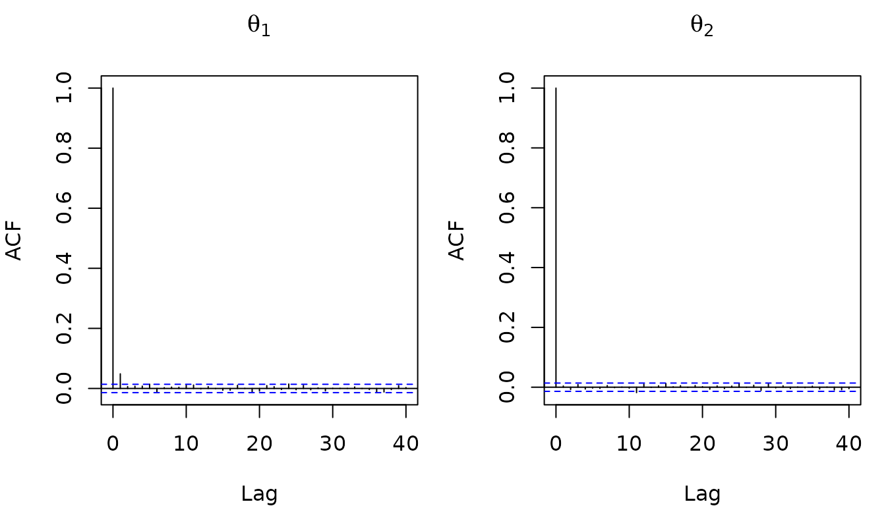
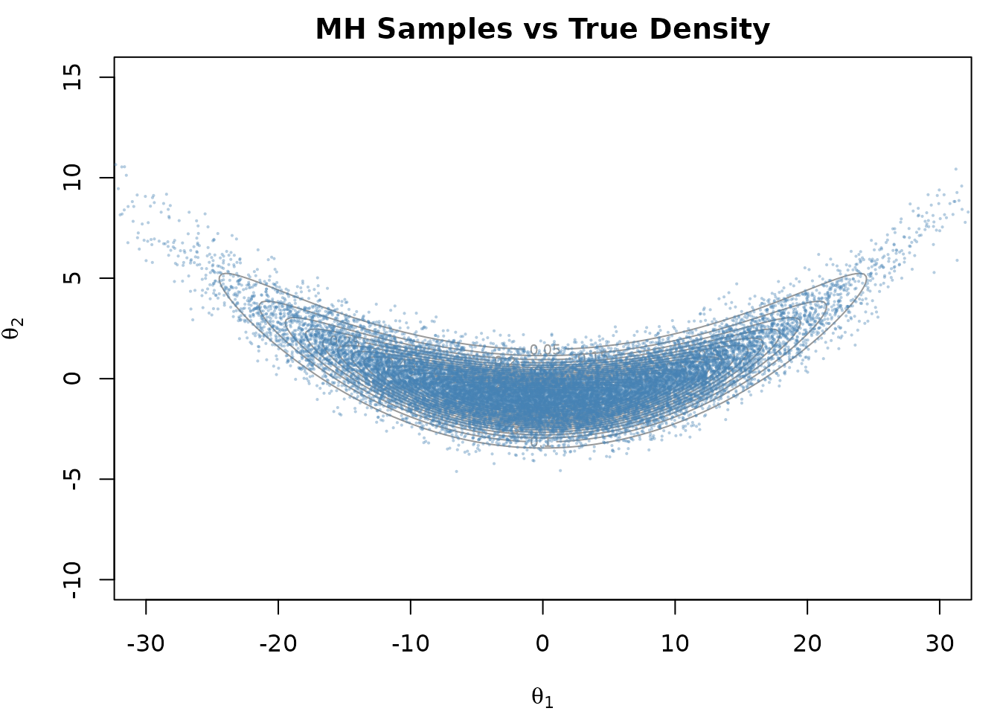
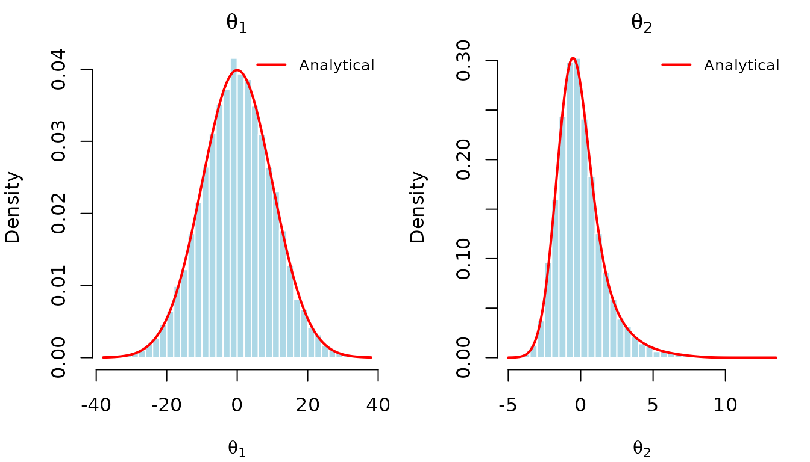

# Metropolis-Hastings

In this vignette, we show how to implement a random-walk
Metropolis-Hastings sampler using {anvil} (Hastings 1970).
Metropolis-Hastings is a well known MCMC algorithm that generates
samples from a target distribution by proposing moves and accepting or
rejecting them based on the density ratio.

## The Banana Distribution

We sample from a “banana-shaped” distribution (Haario, Saksman, and
Tamminen 1999). This 2-dimensional distribution consists of two Gaussian
densities, where the second is dependent on the first:

\\p(\theta_1, \theta_2) = \underbrace{\frac{1}{\sqrt{200\pi}}
\exp\\\left(-\frac{\theta_1^2}{200}\right)}\_{p(\theta_1)} \\\cdot\\
\underbrace{\frac{1}{\sqrt{2\pi}} \exp\\\left(-\frac{\bigl(\theta_2 -
b\theta_1^2 + 100b\bigr)^2}{2}\right)}\_{p(\theta_2 \mid \theta_1)}\\

While it is trivial to sample from this distribution directly, it serves
as a useful test case for our Metropolis-Hastings sampler
implementation. The distribution has known analytical moments which we
will use later to verify the correctness of our implementation. We set
the hyperparameter \\b\\ to 0.01.

``` r
library(anvil)
b_param <- 0.01
```


## Metropolis-Hastings Algorithm

The random-walk Metropolis-Hastings algorithm proceeds as follows:

1.  Propose \\\theta' = \theta + \varepsilon\\, where \\\varepsilon \sim
    \mathcal{N}(0, s^2 I)\\
2.  Compute the acceptance ratio \\\alpha = p(\theta') / p(\theta)\\
3.  Accept \\\theta'\\ with probability \\\min(1, \alpha)\\

In practice, we work with log-densities rather than densities directly.
Density values can become extremely small in high-dimensional or
concentrated distributions, causing floating-point underflow. By
operating in log-space, the acceptance ratio \\p(\theta') / p(\theta)\\
becomes a simple difference \\\log p(\theta') - \log p(\theta)\\, which
is numerically stable. Furthermore, because the algorithm only ever
evaluates *ratios* of densities, any normalizing constant cancels out in
the difference. This means we only need to know the log-density up to an
additive constant.

The log-density of the banana distribution (up to a constant) is:

\\\log p(\theta_1, \theta_2) = -\frac{\theta_1^2}{200} -
\frac{\bigl(\theta_2 - b\theta_1^2 + 100b\bigr)^2}{2}\\

We implement this in {anvil} and convert the parameter to an `f64`
tensor for maximal precision.

``` r
b_t <- nv_scalar(b_param, dtype = "f64")

log_density <- function(theta, b) {
  theta1 <- theta[1]
  theta2 <- theta[2]
  -theta1^2 / 200 - (theta2 - b * theta1^2 + 100 * b)^2 / 2
}
```

There are a few things to note in the code below:

1.  the accept/reject decision uses the primitive
    [`nv_if()`](https://r-xla.github.io/anvil/dev/reference/nv_if.md)
    and not a native R conditional.
2.  we sample a scalar uniform random number by setting
    `shape = integer()`
3.  the RNG state is passed around explicitly.

``` r
mh_step <- function(theta, rng_state, b, proposal_sd) {
  rng_out <- nv_rnorm(shape(theta), rng_state, dtype = "f64")
  rng_state <- rng_out[[1L]]
  proposal <- theta + proposal_sd * rng_out[[2L]]

  log_current <- log_density(theta, b)
  log_proposed <- log_density(proposal, b)
  log_accept <- log_proposed - log_current

  rng_out <- nv_runif(integer(), rng_state, dtype = "f64")
  rng_state <- rng_out[[1L]]
  u <- rng_out[[2L]]

  accept <- log(u) < log_accept
  new_theta <- nv_if(accept, proposal, theta)
  list(theta = new_theta, rng_state = rng_state)
}
```

Because subsequent samples are autocorrelated, we thin the output by
keeping every nth sample. We implement this loop via
[`nv_while()`](https://r-xla.github.io/anvil/dev/reference/nv_while.md)
below, avoiding R loop overhead.

``` r
mh_sample <- jit(function(theta, rng_state, b, proposal_sd, thin) {
  result <- nv_while(
    init = list(theta = theta, rng_state = rng_state, i = nv_scalar(0L)),
    cond = \(theta, rng_state, i) i < thin,
    body = \(theta, rng_state, i) {
      c(mh_step(theta, rng_state, b, proposal_sd), list(i = i + 1L))
    }
  )[1:2]
})
```

## Running the Sampler

We specify the required parameters and run the sampler. Again, note that
we are passing around the RNG state explicitly.

``` r
n_samples <- 20000L
n_warmup <- 5000L
thin <- nv_scalar(200L)

theta <- nv_tensor(c(0, 0), dtype = "f64")
rng_state <- nv_rng_state(seed = 42L)
proposal_sd <- nv_scalar(3, dtype = "f64")

result <- mh_sample(theta, rng_state, b_t, proposal_sd, thin)
theta <- result$theta
rng_state <- result$rng_state

for (i in seq_len(n_warmup)) {
  result <- mh_sample(theta, rng_state, b_t, proposal_sd, thin)
  theta <- result$theta
  rng_state <- result$rng_state
}

thetas <- vector("list", n_samples)

for (i in seq_len(n_samples)) {
  result <- mh_sample(theta, rng_state, b_t, proposal_sd, thin)
  theta <- result$theta
  rng_state <- result$rng_state
  thetas[[i]] <- theta
}

samples <- do.call(rbind, lapply(thetas, function(x) as.vector(as_array(x))))
colnames(samples) <- c("theta1", "theta2")
```

Next, we compare the results with the analytical moments to see whether
everything worked as expected.

## Inspecting the Results

The autocorrelation function (ACF) of the thinned samples shows that
successive draws are nearly independent:



The banana distribution has known analytical moments. Since \\\theta_1
\sim \mathcal{N}(0, 100)\\ and \\\theta_2 \mid \theta_1 \sim
\mathcal{N}(b\theta_1^2 - 100b, 1)\\:

- \\\mathbb{E}\[\theta_1\] = 0\\, \\\text{SD}\[\theta_1\] = 10\\
- \\\mathbb{E}\[\theta_2\] = 0\\, \\\text{SD}\[\theta_2\] = \sqrt{2
  \cdot 10^4 b^2 + 1}\\

&nbsp;

    ##   Parameter     MH_Mean True_Mean    MH_SD   True_SD
    ## 1    theta1 0.032508472         0 9.977817 10.000000
    ## 2    theta2 0.008427101         0 1.720547  1.732051

The Metropolis-Hastings estimates closely match the analytical moments,
confirming the correctness of our implementation.

We can visualize the samples against the true density contours:



And overlay the analytical marginal densities on histograms of the
samples.



Haario, Heikki, Eero Saksman, and Johanna Tamminen. 1999. “Adaptive
Proposal Distribution for Random Walk Metropolis Algorithm.”
*Computational Statistics* 14 (3): 375–95.

Hastings, W Keith. 1970. “Monte Carlo Sampling Methods Using Markov
Chains and Their Applications.”
